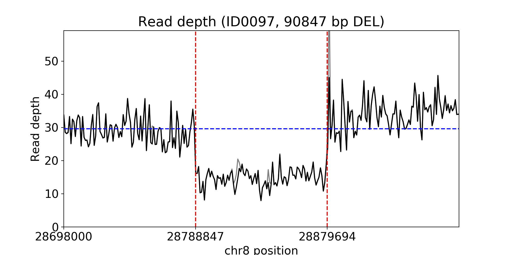
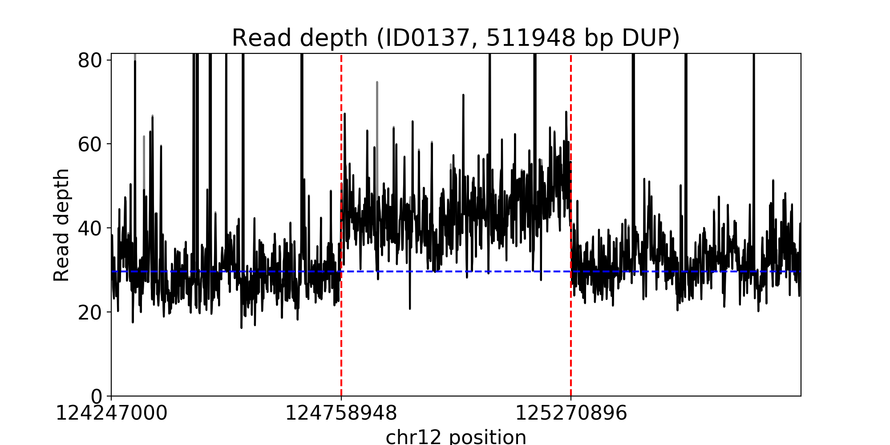
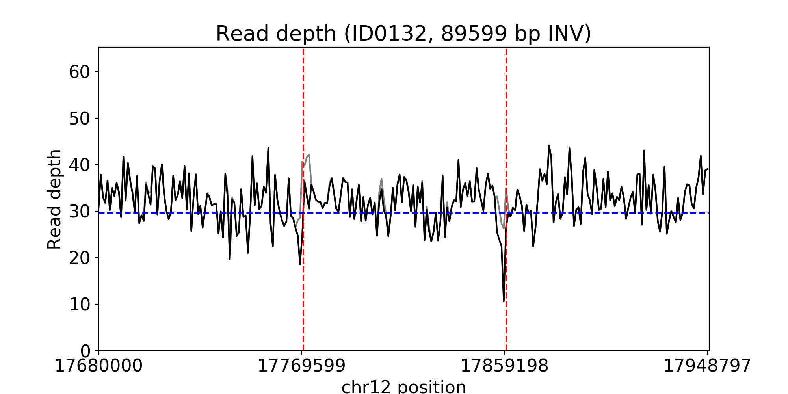
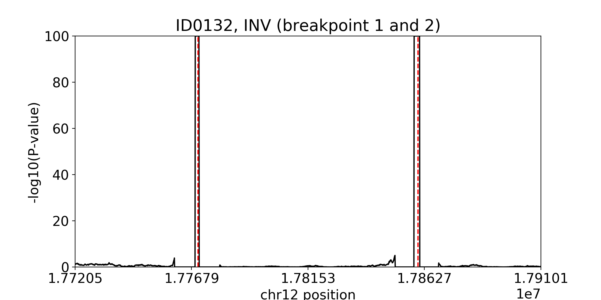
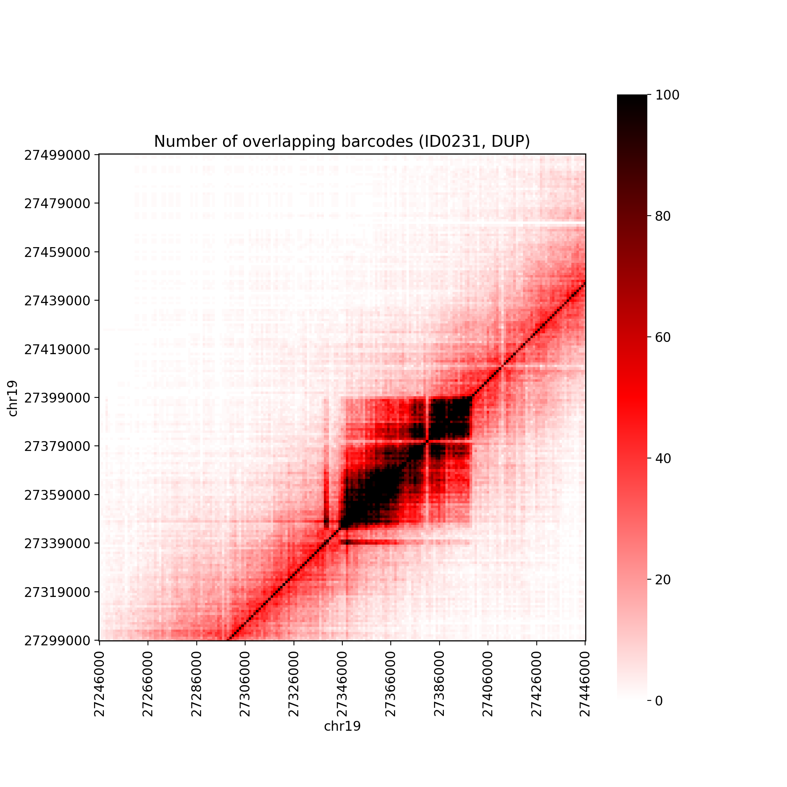
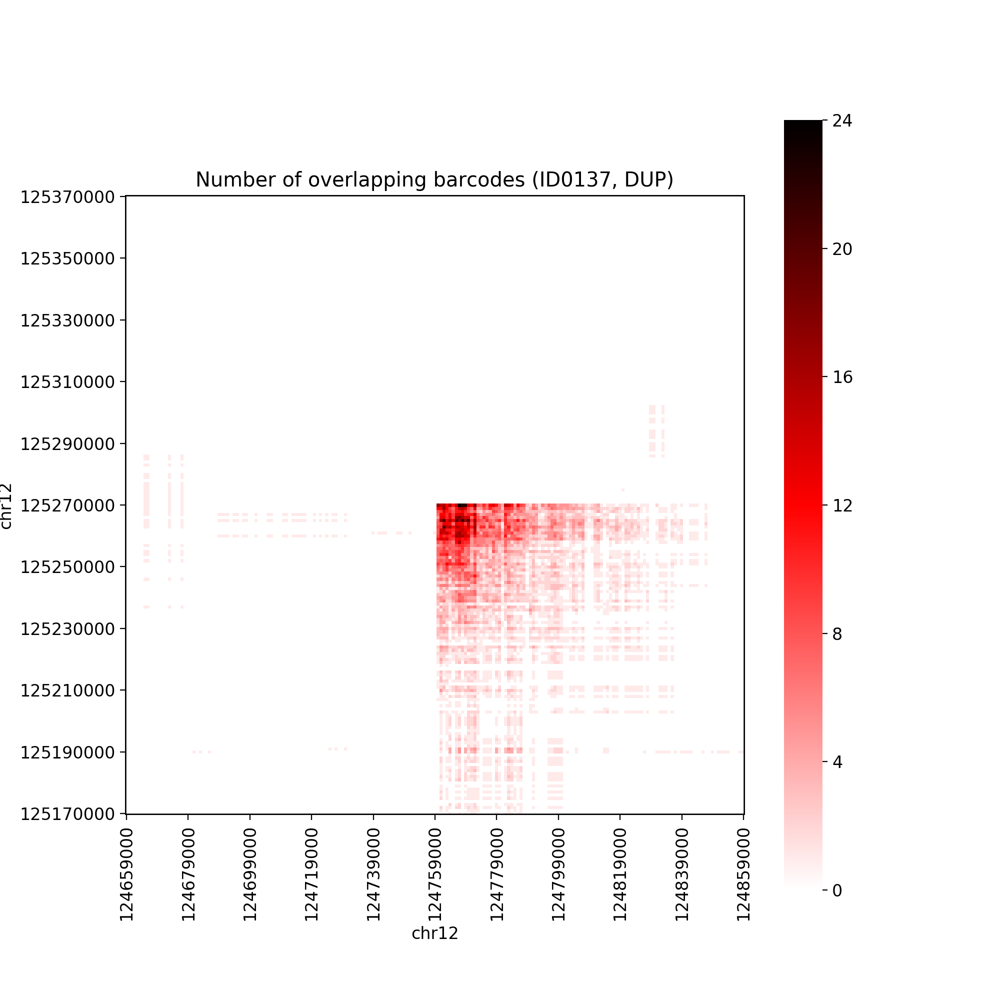
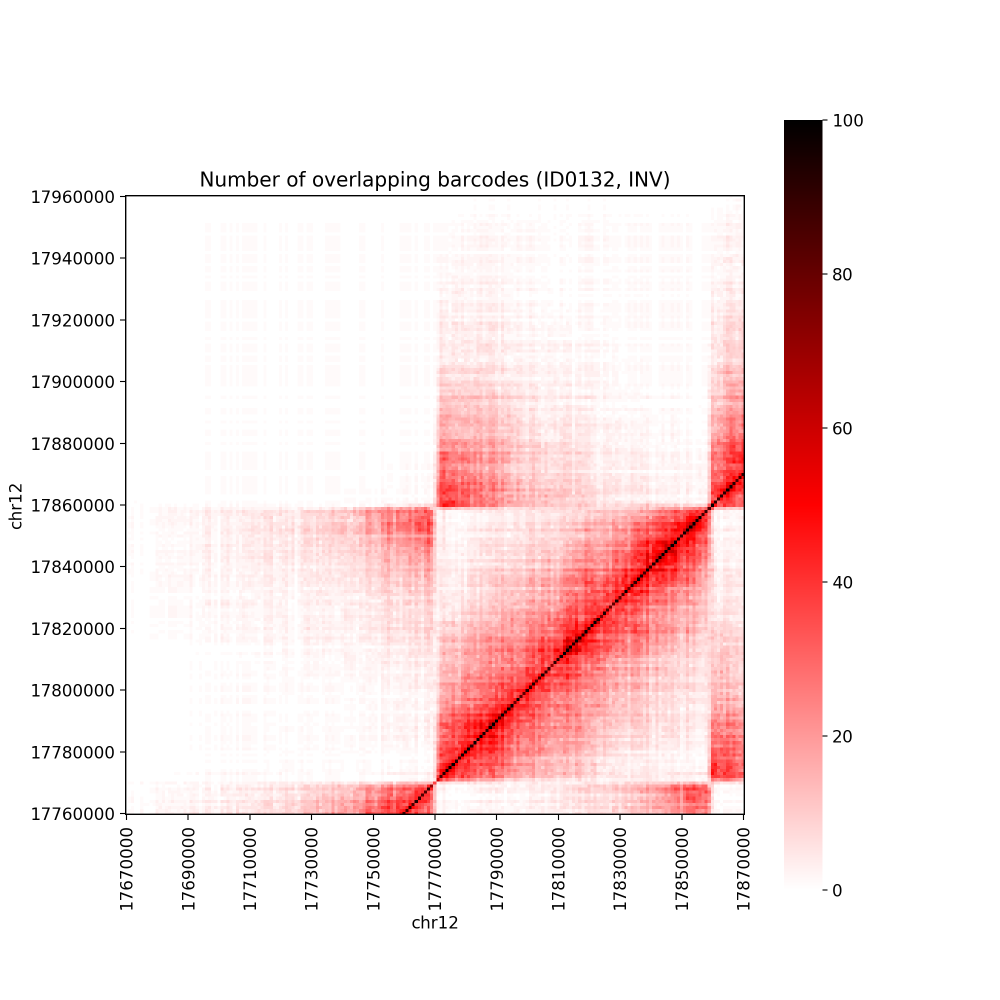

# Users' Guide

LinkedSV is a novel structural variant caller for 10X Genomics (linked-read) sequencing data. It detects deletions, duplications, inversions and translocations using evidence from the barcoded reads. 

## Table of Contents
- [Installation](#Installation)
  - [Prerequisites](#Prerequisites)
  - [Compilation](#Compilation)
- [Usage](#Usage)
  - [General usage](#General_usage)
  - [Use cases](#Use_cases)
- [Output Files](#Output)
  - [SV call file](#SV_call_file)
  - [Intermediate files](#Intermediate_files)
- [Visualization of SV calls](#Visualization)
  - [Read depth](#read_depth)
  - [Twin-window evidence](#Twin_window_evidence)
  - [Heat Map of overlapping barcodes](#Heat_Map)
- [Future extensions](#Future_extensions)
- [Citation](#Output)
- [Getting Help](#Getting_Help)


## <a name="Installation"></a>Installation

### <a name="Prerequisites"></a> Prerequisites

Most of the source code was written in Python, but the time-consuming steps were written in C. It uses htslib to process bam files.

The following software tools and packages are required for the installation of LinkedSV. 

1. GCC (version >= 4.4)

2. Python (version: 2.7)

3. Python packages: sklearn, scipy, numpy, gzip, psutil, subprocess, bisect, math, argparse, pandas, seaborn, datetime

You can use `pip` to install a python package. For example, if you want to install sklearn, you can use the following command: 

```
pip install --user sklearn
```

The `--user` tells pip to install the seaborn in your own directory, so that you don't need root access. 

If you don't have `pip` in your system, you can install pip according to the instructions [here](https://pip.pypa.io/en/stable/installing/)

4. [SAMtools](https://github.com/samtools/samtools) (version >= 1.3)

5. [BEDTools](https://bedtools.readthedocs.io/en/latest/)


### <a name="Compilation"></a> Compilation

If the above tools and packages are avaiable, you can use the following command to download and compile LinkedSV: 

```
git clone https://github.com/WGLab/LinkedSV.git 
cd LinkedSV/
sh build.sh 
```


## <a name="Usage"></a>Usage

```
usage: linkedsv.py [-h] -i input.phased_possorted_bam.bam -d output_directory
                   -r ref.fa [-v version] [--gap_region_bed BED]
                   [--black_region_bed BED] [-t num_thread]
                   [--min_fragment_length INT] [--min_reads_in_fragment INT]
                   [--min_supp_barcodes INT] [--samtools path/to/samtools]
                   [--bedtools path/to/bedtools] [--wgs] [--targeted]
                   [--germline_mode] [--somatic_mode] [--target_region BED]
                   [--gap_distance_cut_off INT] [--save_temp_files]

```
## <a name="General_usage"></a>General usage

The `input.phased_possorted_bam.bam` is the input bam file, which contains the barcoded reads. LinkedSV read the barcodes from the `BX` tag in the bam TAG field. We recommend using the `phased_possorted_bam.bam` file generated by the official Longranger pipeline.

The `ref.fasta` file is the FASTA file of the reference genome. It should be the same fasta file that was used for alignment. The `ref.fasta` file should be indexed by samtools. You can use the following command to index a `ref.fasta` file:

```
samtools faidx ref.fasta
```

This command will generate a `ref.fasta.fai` file in the same directory of the `ref.fasta` file. 

`output_directory` is the directory where the output files will be generated. 

`black_region_bed` is the blacklist file for filtering SV calls. The blacklist contains a small set of regions that give consistently spurious signal across samples. We prepared `black_region_bed` for human reference genomes (versions: hg19, b37, hg38), so you don't need to provide it if you use hg19, b37, or hg38. 

`gap_region_bed` is the bed file of gap regions in the reference genome. It is used to filter the SV calls. LinkedSV provides `gap_region_bed` for human reference genomes (versions: hg19, b37, hg38), so you don't need to provide it if you use hg19, b37, or hg38. 

`ref_version` is used to tell LinkedSV which `black_region_bed` file and `gap_region_bed` file should be used. Currently we have generated blacklists for hg19 (style: "chr1"), b37 (style: "1") and hg38 (style: "chr1"). It is **highly recommended** to spcifiy `ref_version` if you are using these three versions. The valid values are: hg19, b37, hg38. 

If you are using a different reference file, please generate the `black_region_bed` file and the `gap_region_bed` file by yourself and specify the `--gap_region_bed` and `--black_region_bed` parameters.

If you don't have samtools and bedtools in your path, please specify the path using `--samtools` and `--bedtools`. 


### <a name="Use_cases"></a> Use cases: 

**Detection of germline SVs from whole-genome sequencing**

```
python linkedsv.py -i input.phased_possorted_bam.bam -d path/to/output_dir/ -r hg38.fa -v hg38 -t 4 --germline_mode
```
The `-v hg38` parameter specify that the reference genome is hg38. If you use another version, please change accordingly. 
We recommend using at least 4 threads to speed up the run. Each thread need 4GB memory.


**Detection of germline SVs from targeted sequencing (e.g. whole-exome sequencing)**

```
python linkedsv.py -i phased_possorted_bam.bam -d path/to/output_dir/ -r ref.fasta -v hg38 -t 4 --targeted --target_region path/to/target_region.bed --germline_mode
```

`target_region.bed` is a bed file that contains the target regions (capture regions). 

**Detection of somatic SVs from whole-genome sequencing** 

```
python linkedsv.py -i input.phased_possorted_bam.bam -d path/to/output_dir/ -r ref.fasta -v hg38 -t 4 --somatic_mode
```


## <a name="Output"></a> Output Files

LinkedSV will output the SV calls, as well as the figures that allow you to visualize the call. 

### <a name="SV_call_file"></a> SV call file

LinkedSV will output two SV call files, `prefix.raw_svcalls.bedpe` and `prefix.filtered_svcalls.bedpe`. The `prefix.raw_svcalls.bedpe` file contains a raw, unfiltered, highly sensitive callset in BEDPE format. and may contain many false positives calls. The `prefix.filtered_svcalls.bedpe` file contains the filtered SV calls. In most cases, you only need to look at the `prefix.filtered_svcalls.bedpe`. 

The BEDPE format was defined by BEDtools (https://bedtools.readthedocs.io/en/latest/content/general-usage.html). It can be used to concisely describe disjoint genome features, such as structural variations. We did not use BED format because BED format does not allow inter-chromosomal feature definitions.

The `prefix.filtered_svcalls.bedpe` file contains one SV per line with the following tab-delimited columns:


|Column|Description|
|:----|:-----------------------------------------|
|chrom1|chrom of breakpoint 1|
|start1|start position of breakpoint 1|
|stop1|end position of breakpoint 1|
|chrom2|chrom of breakpoint 2|
|start2|start position of breakpoint 2|
|stop2|end position of breakpoint 2|
|sv_type|SV type inferred from breakpoints|
|sv_id|unique ID of the SV|
|sv_length|SV length|
|filter|filter. 'PASS' if the call passed all filtering steps.| 
|num_supporting_fragments|number of fragment pairs that support the SV|
|num_supporting_read_pairs|number of read pairs that support the SV|
|endpoint1_type|type of enriched fragment endpoint near breakpoint 1|
|endpoint2_type|type of enriched fragment endpoint near breakpoint 2|
|qual_score|quality score of the SV|
|supporting_barcodes|barcode sequences of the fragments that support the SV|

For the meaning of "endpoint1_type" and "endpoint2_type", please refer to our manuscript ([Citation](#Citation))

### <a name="Intermediate_files"></a> Intermediate files

LinkedSV also output some intermediate files:

```
prefix.bcd21.gz
prefix.bcd13
prefix.read_depth.txt
```

These files contains the data that can be used to visualize the SV evidence. 

LinkedSV will also generate a `images` directory in the output directory. The figures showing the evidence of the SV are under this directory. 

## <a name="Visualization"></a> Visualization of SV calls

After SV calling, LinkedSV will plot high-resolution figures showing the evidence of the SV, so that you can see them intuitively. 

Currently, LinkedSV will plot 3 types of evidence:
1) read depth (for all SV calls)
2) evidence of decrease of overlapping barcodes between adjcent twin windows (for balanced SV calls)
3) Heat maps of overlapping barcodes (for all SV calls)

These figures are generated in the `images` directory under the output directory. The structure of the `images` directory is:

```
linkedsv_out_dir
|-- images
    |-- read_depth
        |-- prefix.ID01.read_depth.png
        |-- prefix.ID02.read_depth.png
        
    |-- twin_window_barcode_similarity
        |-- prefix.ID01.breakpoint1.twin_window_barcode_similarity.png
        |-- prefix.ID01.breakpoint2.twin_window_barcode_similarity.png
        |-- prefix.ID02.both_breakpoints.twin_window_barcode_similarity.png 
        
    |-- 2D_heatmap
        |-- prefix.ID01.heatmap.png
        |-- prefix.ID01.heatmap.png
```


### <a name="read_depth"></a> Read depth

Here are some example figures for different SV types. The figures were plotted from the SV calls on the [HX1 genome](http://dx.doi.org/10.1038/ncomms12065). The dotted blue line showed the average depth across the whole genome. The predicted breakpoints were indicated by vertical red lines. The black line showed the depth of confidently mapped reads (map quality >= 20) and the grey line showed the depth of all reads (map quality >= 0). The black line is in front of the grey line. So if you do not see the grey lines, then the black and grey lines are in the same place (i.e. the region is of high map quality). 

**Deletion**

The region between the two red lines has lower read depth. 


**Duplication**

The region between the two red lines has higher read depth. 


**Inversion**

The region between the two red lines has same read depth as the flanking regions. 


 
### <a name="Twin_window_evidence"></a> Twin-window evidence

LinkedSV plots the twin-window evidence for balanced SV events, such as inversions and balanced translocations. The barcodes between two nearby genome locations is highly similar because the two locations are spanned by almost the same set of input HMW DNA molecules. However, due to the genome rearrangement, the reads mapped to the left side and right side of a breakpoint may originate from different locations of the alternative genome and thus have different barcodes. 

Dropped barcode similarity between two nearby loci therefore indicates a SV breakpoint. LinkedSV detects this type of evidence by a twin-window method, which uses two adjacent sliding windows to scan the genome and find regions where the barcode similarity between the two nearby window regions are significantly decreased. (Please refer to our manuscript for the detailed explaination: [Citation](#Citation) )

Here is an example figure of the twin-window evidence. It was plotted from an inversion call on the HX1 genome. X-axis is the position of the middle of the twin windows. Y-axis is the -log10(P-value), where P-value means the probabity that the overlapping barcodes between the twin windows is less than or equal to the observed number assuming no SV. 

In the following figure, the red line showed the predicted breakpoint. Since the P-value is very small at the breakpoints, Y values (-log10(P-value)) are very high and form two peaks at the breakpoints. 


**Inversion**



### <a name="Heat_Map"></a> Heat map of overlapping barcodes


LinkedSV also plots the 2D heat maps of overlapping barcodes. This figure is similar to the figure showed by [Loupe](https://support.10xgenomics.com/genome-exome/software/visualization/latest/what-is-loupe), which was developped by 10X Genomics. The slight difference is that the color map of LinkedSV is of wider range (0-100). 

The resolution is 1000 bp. The color of each dot indicates the number of overlapping barcodes between two genomics positions (X and Y coordinates of the dot). 

Some example figures are here. 

**Deletion**


**Duplication**




**Inversion**



## <a name="Future_extensions"></a> Future extensions 
Recently, [BGI](https://www.bgi.com/us/) and [Complete Genomics](https://www.completegenomics.com/) developped **single tube long fragment read (stLFR)** ([Genome Res. 2019](https://genome.cshlp.org/content/early/2019/04/02/gr.245126.118.abstract)), a technology that enables sequence data from long DNA molecules using second-generation sequencing technology. It is based on adding the same barcode sequence to sub-fragments of the original long DNA molecule (DNA co-barcoding). Since this technology is also a barcoded sequencing of long fragments, LinkedSV is planned to support stLFR in the near future. 


 

## <a name="Citation"></a> Citation
If you use LinkedSV in your work, please cite:
> Li Fang, Charlly Kao, Michael V Gonzalez, Fernanda A Mafra, Renata Pellegrino da Silva, Mingyao Li, Soren Wenzel, Katharina Wimmer, Hakon Hakonarson, Kai Wang. LinkedSV: Detection of mosaic structural variants from linked-read exome and genome sequencing data. bioRxiv 409789; doi: https://doi.org/10.1101/409789

## <a name="Getting_Help"></a> Getting Help

Please use the [GitHub's Issues page](https://github.com/WGLab/LinkedSV/issues) if you have questions.
